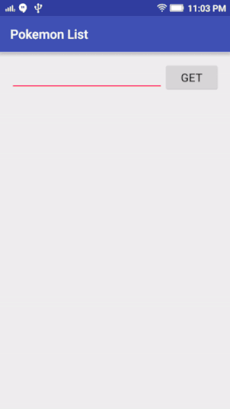

# Pokemon List
App created for learning to implement retrofit with pokemon-api. Usefull for understand the basic concepts on Android where you can understand also how recycler view works.

# More information about Pokemon API
https://pokeapi.co/

# Resources implemented on this project

http://square.github.io/retrofit/
http://jakewharton.github.io/butterknife/
http://www.androidhive.info/2016/05/android-working-with-retrofit-http-library/
http://jsonviewer.stack.hu/
http://www.jsonschema2pojo.org/

